# ReplayForge

从真实运行效果、代码理解，或两者结合，自动生成高质量的项目演示内容。

ReplayForge 可以把 GitHub 项目转换成清晰、美观的演示视频和解释动画。它支持三种生成模式：

- `capture`：真实录制项目的运行效果。适合 Web App、CLI、组件库。
- `explain`：读取代码和文档，生成解释动画。适合库、框架、AI 工具、复杂 CLI。
- `hybrid`：先解释项目做什么，再录制实际运行效果。最适合 README 首页、项目介绍页和产品展示。

ReplayForge 帮助开发者快速展示项目价值，不需要手动写脚本、录屏、剪辑视频或制作复杂动画。

## Quick Start

在当前项目目录生成：

```bash
npm install
node ./bin/replayforge.mjs init
node ./bin/replayforge.mjs generate
```

直接指定 GitHub 仓库生成：

```bash
node ./bin/replayforge.mjs generate https://github.com/whut09/ReplayForge
```

默认模式是 `hybrid`。也可以手动指定：

```bash
node ./bin/replayforge.mjs generate --mode capture
node ./bin/replayforge.mjs generate --mode explain
node ./bin/replayforge.mjs generate --mode hybrid
```

指定远程 GitHub 地址时，ReplayForge 会先克隆并分析仓库，但默认不会执行陌生仓库里的脚本。只对可信仓库使用 `--allow-run`：

```bash
node ./bin/replayforge.mjs generate https://github.com/owner/repo --allow-run
```

## What It Generates

本地项目默认输出：

```text
assets/replayforge/
  README.demo.md
  demo.html
  demo.svg
  recording-plan.json

.replayforge/
  local/
    profile.json
    storyboard.json
```

远程 GitHub 仓库默认输出：

```text
assets/replayforge/<owner-repo>/
  README.demo.md
  demo.html
  demo.svg

.replayforge/remotes/<owner-repo>/
  cloned repository
```

`demo.svg` 可以直接放进 GitHub README；`demo.html` 是 16:9 演示页面，后续可接 Playwright 和 ffmpeg 导出 GIF/MP4。

## Configuration

```json
{
  "mode": "hybrid",
  "outputDir": "assets/replayforge",
  "project": {
    "name": "ReplayForge",
    "tagline": "Generate polished README demos automatically."
  },
  "capture": {
    "kind": "terminal",
    "commands": [
      "npm run build",
      "npm test"
    ]
  },
  "explain": {
    "includeFiles": ["README.md", "package.json", "src"],
    "maxHighlights": 5
  }
}
```

## Commands

```bash
replayforge init
replayforge analyze [github-url|local-path]
replayforge generate [github-url|local-path]
replayforge record
```

## Roadmap

- Playwright browser capture for Web App flows
- ffmpeg GIF/MP4 export
- richer code explanation scenes
- README anchor insertion
- GitHub Action integration

<!-- replayforge:start -->
## Demo



从真实运行效果、代码理解，或两者结合，自动生成高质量的项目演示内容。

### Quick Start

```bash
npm install
npm run start
```

### What ReplayForge Generated

- **Explain: replayforge** - ReplayForge explains what the project does from README, package metadata and source structure.
- **Analyze: Code and docs become scenes** - The generator reads common project files and promotes the strongest facts into a storyboard.
- **Capture: Real command output** - ReplayForge captures the commands users should trust most: install, run, generate and verify.
- **Export: README-ready output** - ReplayForge writes a reusable README section plus a browser-ready presentation asset.

<!-- replayforge:end -->
